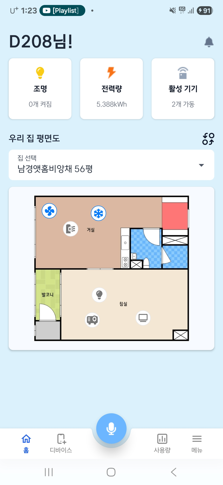

# README

상태: 계획
날짜: 2025년 9월 30일
요약: 프로젝트 설명이 없습니다.

# 프로젝트 개요

## 개발 기간

| **개발 기간** | **2025.08.25 ~ 2025.10.02 (6주)** |
| --- | --- |

## 팀원 소개

| 박주현 | 편민우 | 이유민 | 윤경진 | 이채영 | 이태훈 |
| --- | --- | --- | --- | --- | --- |
| **팀장, Embedded, AI** <br> **[PM]** Jira & Notion 일정 관리 및 명세서 최신화 <br> ERD 설계 및 정규화 <br> Mqtt 통신 프로토콜 토픽 설계 <br> 발표 자료 작성 <br> **[Embedded]** IR 수신 센서 & 온습도 센서 연동 <br> CSV Parser 구현 로그 저장 <br> Mqtt Client 구현 및 연결 <br> **[MFC]** Webview2 기반 대시보드, Log/Device/Env Factor 패널 구현 <br> **[AI]** LightGBM 기반 자동 제어, K-Means 기반 환경 가중치 계산 | **Embedded** <br> ESP32 기반 하드웨어 제어 및 GPIO 설정 <br> RMT 모듈을 활용한 IR 송신 <br> UART 통신 및 JSON 파싱 <br> NVS Flash 설정 관리 <br> RAW IR 데이터 송신 <br> FreeRTOS 멀티태스킹 시스템 <br> MQTT Client 구현 및 연결 <br> Wifi 연결 관리 및 재연결 로직 <br> **Database** IR 코드 학습/저장 <br> **Security** MQTT TLS 통신, 시리얼 토큰 인증 | **Backend, Infra** <br> 사용자/홈/평면도/디바이스/허브/루틴 API 개발 <br> 전력 사용량 리포트 API <br> 스케줄러 기반 루틴 실행 <br> **Infra** EC2 서버환경 구축, Docker Compose 서비스 구성 <br> Jenkins CI/CD 파이프라인 구축 및 배포 자동화 <br> Nginx Reverse Proxy + TLS 적용 <br> **DB** ERD 설계 및 PostgreSQL 마이그레이션 관리 | **AI, Backend, Infra** <br> **[AI]** 웨이크워드 → STT 전환 <br> 규칙 기반 NLU (다절 분리/슬롯 매핑) <br> 대화형 루틴 생성 <br> TTS 응답 & 이어콘 UX <br> 상태 질의 처리 로직 <br> **[Backend]** MQTT 제어·로깅 연동 <br> IR 신호 송수신 및 이벤트 로그 적재 <br> 루틴 실행 시 FCM 푸시 발송 <br> **[Android]** Foreground Service 음성 인식 <br> 마이크 단일 점유 처리 <br> 사용자 피드백(TTS + 이어콘) UX <br> FCM 알림 수신 및 딥링크 처리 <br> **Infra/DB** Jenkins CI/CD, PostgreSQL 관리 | **Android, Design** <br> **[Android]** 회원가입 화면 개발 <br> 홈 평면도 기능 개발 <br> 로그 동적 표시 <br> 루틴 CRUD <br> Navigation Bar 화면 연결 <br> Naver Map 연동 <br> 애니메이션 TabRow 구현 <br> @parcelize 데이터 전달 <br> **[Design]** Figma 와이어프레임 <br> 로고 제작 <br> 홈/회원가입/로그/루틴 화면 UI/UX | **Android, Design** <br> **[Android]** Jetpack Compose 개발 <br> Spring API 연결 <br> 디바이스 탭 기능 (QR 인식, 아이콘 위치/색상, 상태 제어) <br> 사용량 탭 기능 (일간/주간/월간/연간 리포트, AI 요약, Vico 차트, YCharts 파이차트) <br> 마이페이지 탭 (사용자 정보) <br> **[Design]** Figma 와이어프레임 <br> 디바이스/사용량/마이페이지 UI/UX |


## 기획 의도

| [2017년부터 스마트홈 시장 규모가 꾸준하게 늘어나고 있으며 연평균 10%가 넘는 성장세가 지속될 것이라 예측 (LH 매거진 스마트홈 3편)](https://www.lh.or.kr/gallery.es?mid=a10503000000&bid=0004) |
| --- |
| [IOT 지원 가전](https://www.coupang.com/vp/products/8760857848?itemId=25474503095&vendorItemId=92466938244&src=1042503&spec=10304025&addtag=400&ctag=8760857848&lptag=8760857848-25474503095&itime=20250910165428&pageType=PRODUCT&pageValue=8760857848&wPcid=17519462969958823268796&wRef=www.google.com&wTime=20250910165428&redirect=landing&gclid=Cj0KCQjww4TGBhCKARIsAFLXndRJr8OX1GH-K8q-tDPz8LUg2gigJhyvE6jxIhIOpLq8DuzfcFmsBmgaAnu4EALw_wcB&mcid=2b9b696ac6d148148aab245ec7bee799&campaignid=22815108882&adgroupid=)과 [IOT 미지원 가전](https://www.coupang.com/vp/products/8887410804?itemId=25946727613&vendorItemId=92929872993&q=%EC%BF%A0%EC%BF%A0+%EC%9D%B8%EC%8A%A4%ED%93%A8%EC%96%B4+%EB%B2%BD%EA%B1%B8%EC%9D%B4+%EC%97%90%EC%96%B4%EC%BB%A8%286%ED%8F%89%ED%98%95%29&searchId=407c60e2592661&sourceType=search&itemsCount=36&searchRank=2&rank=2&traceId=mfepbjr6)의 가격 차이가 약 3배 |

# 기술 스택

## Android


## Voice AI


## Backend


## Infra


## Embedded


## Autopilot AI


# 서비스 기능 소개

## 평면도
<details open>
  <summary>이미지 펼치기/접기</summary>

  <p float="left" align="center">
    <a href="result/image.png"></a>
    <a href="result/image%201.png"></a>
    <a href="result/image%202.png"></a>
  </p>
</details>

## 디바이스
<details open>
  <summary>이미지 펼치기/접기</summary>

  <p float="left" align="center">
    <a href="result/image%203.png"></a>
    <a href="result/image%204.png"></a>
  </p>
  <p float="left" align="center">
    <a href="result/image%205.png"></a>
    <a href="result/image%206.png"></a>
  </p>
</details>

## 루틴
<details open>
  <summary>이미지 펼치기/접기</summary>

  <p float="left" align="center">
    <a href="result/image%207.png"></a>
    <a href="result/image%208.png"></a>
    <a href="result/image%209.png"></a>
  </p>
  <p float="left" align="center">
    <a href="result/image%2010.png"></a>
    <a href="result/image%2011.png"></a>
    <a href="result/image%2012.png"></a>
  </p>
  <p float="left" align="center">
    <a href="result/image%2013.png"></a>
    <a href="result/image%2014.png"></a>
  </p>
</details>

## 사용량
<details open>
  <summary>이미지 펼치기/접기</summary>

  <p float="left" align="center">
    <a href="result/image%2015.png"></a>
    <a href="result/image%2016.png"></a>
  </p>
  <p float="left" align="center">
    <a href="result/image%2017.png"></a>
    <a href="result/image%2018.png"></a>
  </p>
</details>

## 음성 인식
- [개별 제어](https://youtube.com/shorts/5yrWLTCyypk)
- [방별 제어](https://youtube.com/shorts/bE8je6z2MmY)
- [전체 제어](https://youtube.com/shorts/iQVL4P4wQwU)
- [상태 질의](https://youtube.com/shorts/u85Gj2mkLp8)
- [루틴 생성](https://youtube.com/shorts/uV-kE1EFaH4)

## 임베디드
<details open>
  <summary>이미지 펼치기/접기</summary>

  <p float="left" align="center">
    <a href="result/image%2019.png"></a>
  </p>
  <p float="left" align="center">
    <a href="result/image%2020.png"></a>
  </p>
</details>

# 기술적 특징

## 🎙 규칙 기반 음성 인식

- 구글 STT와 규칙 기반 NLU를 결합하여 다양한 발화 패턴을 처리합니다.
- 약 **31개 의도**와 **79만 가지 발화 조합**을 지원하며, TTS로 결과를 피드백해 사용자 경험을 강화합니다.
- Wake Word(“제니야”) 호출을 통해 손쉽게 음성 명령을 실행할 수 있습니다.

## 🏠 평면도 기반 디바이스 관리

- 실제 평면도를 DB에 저장하고, 방을 색상 매핑하여 관리합니다.
- 디바이스 아이콘 위치를 **x, y 비율 좌표**로 기록해 어떤 평면도 크기에서도 정확한 위치 표시가 가능합니다.
- 직관적인 시각화를 통해 집안 가전을 한눈에 확인하고 제어할 수 있습니다.

## ⏰ 루틴 기능

- 원하는 요일과 시간을 설정해 **알람처럼 가전을 예약 제어**할 수 있습니다.
- 대화형 루틴 생성이 가능해 화면 없이도 음성만으로 설정할 수 있습니다.
- 반복되는 생활 패턴을 자동화하여 편리성을 높입니다.

## ⚡ 마이크로초 단위 제어

- **ESP32 RMT 모듈 + pigpio 라이브러리**를 활용해 IR 신호를 마이크로초 단위로 정밀 제어합니다.
- 단순 루프 대비 제어 딜레이를 **50μs → 1μs** 수준으로 개선했습니다.
- 사용자 설정은 **ESP32 NVS 플래시**에 저장되어 전원 꺼짐 이후에도 유지됩니다.

## 🔐 보안 아키텍처

- **WPA** 기반 Wi-Fi 네트워크로 무선 접속을 보호합니다.
- **MQTT 통신**은 **TLS 암호화 채널**을 사용해 데이터 변조 및 도청을 방지합니다.
- **사용자 인증 절차**를 거쳐 허가된 클라이언트만 서버에 연결할 수 있도록 설계했습니다.
- 무선 네트워크 → 통신 구간 → 브로커 접속까지 전 구간에 보안을 적용했습니다.

## 📊 자동 제어 (AI 피드백)

- 온습도 센서 데이터로부터 **WBGT, PMV, PPD, 이슬점, 절대습도** 등 6가지 지표를 계산합니다.
- 로그 데이터를 기반으로 **LightGBM 모델**을 학습시켜, 사용자의 불만족 상태를 개선할 수 있는 최적 제어 기준을 도출합니다.
- 개인별 가중치를 적용해 **맞춤형 자동 제어**를 제공합니다.

# 구현 상세

## [음성 인식]

### Wakeword 기반 음성 인식 파이프라인

- **Picovoice Porcupine**으로 웨이크워드(“제니야”) 감지 → **STT(Google)** 전환
- **마이크 단일 점유** 보장 및 안전 해제(`safeStop`)로 **웨이크워드 ↔ STT** 전환 안정화
- STT 1회 실패 시 **즉시 재청취**, 연속 실패 시 **웨이크워드 모드 복귀**로 회복 탄력성 확보.

### 규칙 기반 NLU (자연어 이해)

- `Grammar.yml → RuleCompiler → Regex` 기반 **Intent/Slot 매핑 파이프라인**
- **93개 대표 발화 패턴**으로 **31개 Intent** 정의, **5개 Slot** + **35개 매크로** 조합으로
    
    **≈ 79만** 발화 조합 처리.
    
- **다절 분리**(예: “에어컨 켜고 불 꺼”) + **컨텍스트 상속**(방/기기/숫자) 지원
- 전원 **상태 질의 vs 제어 명령**이 동절 내 충돌 시 **질의 우선** 규칙으로 오작동 방지
- 한국어 구어체 대응: 동의어 표준화(불/조명→전등 등), 한글 사이 **공백 유연화**, 세기 단어(최강/강/중/약) **정규화**

### 대화형 루틴 생성 플로우

- 단순 명령을 넘어 **대화 기반 루틴 설정** 지원.
- 단계: **이름 → 설명 → 요일 → 시간 → 동작** 순 질의/응답 → **루틴 자동 저장**
- 메타 명령(저장/건너뛰기/취소/되돌리기/목록읽기/재설명)로 자연스러운 수정 가능

### 실시간 사용자 피드백 UX

- **TTS**로 실행 결과/상태를 바로 안내.
- 이어콘(SoundPool)으로 웨이크워드 인식·명령 처리 완료 등 **즉시성 피드백** 제공(재생 rate-limit 적용)

### 서비스 레벨 구현

- **Android Foreground Service** 기반 상주로 **백그라운드 항상 대기**
- **FCM** 푸시 수신 및 **딥링크** 연동으로 음성 명령/알림 UX 통합

---

## [네이버 지도]

- 흐름: 상단 검색창으로 **집 목록 필터링 → 목록 탭 → 지도 포커싱 → 인포윈도우 클릭**
- 사용한 Naver Map SDK: `MapView`, `NaverMap`, `Marker`, `InfoWindow`
- Google Fused Location:  초기 카메라 포지셔닝
- 위치 권한 체크: `ACCESS_FINE_LOCATION`, `ACCESS_COARSE_LOCATION`
- 지도 뷰 구성(NaverMapViewComposable)
    - MapView 생명주기 관리
    - `remember { MapView(context) }`로 **1회 생성**
    - `DisposableEffect(Unit)`에서 `onCreate → onStart → onResume`
    - `onDispose`에서 `onPause → onStop → onDestroy`
    - `factory`에서 `getMapAsync`로 **NaverMap 준비 완료 콜백**
    - `update`에서 **houses 변경 시 마커/인포윈도우 업데이트**
- 지도 초기화(setupNaverMap)
    - 기본 위치/줌: 구미 인동 인근(`36.107113, 128.416401`, 확대 17)
    - UI 최소화: 나침반/축척/줌컨트롤/실내 레벨러 비활성
    - **로고 클릭 비활성**, 심벌 스케일 0, **LiteMode 활성**
    - 지도 탭 시: **선택 해제 + 키보드/포커스 해제**
- 위치 권한 & 현재 위치
    - 권한 미허용: `locationSource = null`, `LocationTrackingMode.None`
    - 권한 허용: `FusedLocationSource(activity, 1000)` 설정, `LocationTrackingMode.Face`
    - 최초 1회 **현재 위치**로 카메라 이동(`fused.getCurrentLocation`, `lastLocation` 백업)
    - 위치 연동 실패해도 기본 위치로 안정 동작

## [루틴 기능]

### 루틴 화면 ( 내 루틴/추천루틴)

- **탭형 루틴 관리**: `내 루틴` / `AI 추천 루틴` 2개의 페이지를 **SegmentedTab + HorizontalPager**로 전환.
- 전환/탭 UI (SegmentedTabRow + Pager)
    - **SegmentedTabRow**
        - 라운드 캡슐(하얀 배경)이 선택 탭 영역을 슬라이드 표시
        - **드래그 제스처**(좌우 끌기) + **탭 클릭** 모두 지원
        - `dragOffsetPx` ↔ `selectedIndex`를 애니메이션으로 동기화
    - **HorizontalPager**
        - 탭 선택/드래그 시 `pagerState.animateScrollToPage(idx)`로 페이지 이동
        - page 0: `MyRoutinePage` / page 1: `RecommendRoutinePage`
- 네비게이션 & 이벤트 흐름
    - 헤더 “추가” → `createRoutineFirst`
    - 카드 “수정” → `editRoutineFirst/{id}`
    - 삭제 확인 → VM 삭제 API → 성공 시 `AppEventBus`로 `RoutinesChanged` 발행(다른 화면과 데이터 동기화 가정)
- 안정성/성능
    - `remember`/`LaunchedEffect`로 **중복 API 호출 방지**
    - 아이콘 로딩: `AsyncImage.crossfade()`로 깔끔한 전환
    - 필터 계산은 `remember(routines)`로 **재계산 최소화**

### 루틴 생성/수정

- 화면 구조 & 목적
    - **1단계(CreateRoutineFirstScreen)**: 기본 정보(아이콘/이름/설명/요일/시간) + **동작(Action) 리스트 관리**.
    - **2단계(CreateRoutineSecondScreen)**: 방 → 디바이스 → 상태/세부값(바람세기·온도) 선택 후 **Action 추가**.
    - **모드 분기**: `isEditMode`에 따라 기존 루틴을 로딩해 초기값 채우고, 저장 시 생성/수정 API 분기.\
- 상태 관리(동작추가 갔다와서 원래 정보들 복원 포함)
    - **rememberSaveable**로 폼 상태 보존: `title`, `desc`, `selectedDays(Set<Int> with Saver)`, `hour24`, `minute`, `selectedIconId/Url`, `actions(mutableStateList)`.
    - **LiveData 관찰**:
        - 1단계: `routineDetailV2`, `rooms`, `devices`, `createResult`
        - 2단계: `rooms`, `devices`
    - **편집 모드 초기화**: 루틴 상세 로딩 → 요일 비트마스크/시간/아이콘/동작을 **UI 상태로 역주입**.
        - 동작(details) 복원은 **전체 디바이스/방 목록** 로딩 후 매칭 → `ActionAddedPayload` 재구성(전원/세기/온도 파싱).
- 안정성·유지보수
    - **데이터 무결성**: 좌우 스크린 간 페이로드 전달은 `SavedStateHandle` 키 고정(`new_action_full`).
    - **파싱 안전성**: `deviceDetail` JSON try-catch, 실패 로그 남김.
    - **성능**: `rememberSaveable`로 재구성 최소화, 그리드/리스트는 경량 보더·섀도우.
    - **의존성 최소화**: 시간 변환/요일 파싱은 `ResourceUtils` 통일 사용.
    

---

## MQTT

- **API ↔ MQTT 제어 연동**
    - REST API에서 디바이스/루틴 제어 요청 발생 시, 서버에서 MQTT 메시지 발행 → 허브가 IR 송출 → 응답(ACK/ERROR)을 수신하여 DB 상태 업데이트
    - 모든 요청에 대해 `IrTxQueue`를 통한 **송신 예약/로깅 일원화** 구조 적용
- **발행 로직 설계**
    - `publishIrReq`: 프론트 요청 기반 IR 학습 신호 등록
    - `publishControl`: IR 송신 제어 (UUID 기반 `tx_id` → int 변환 후 전송)
    - `publishSendDevice`: 허브와 IR 송신기 간 바인딩/해제 처리
    - QoS1, non-retain 메시지로 발행하여 **신뢰성 보장 + 중복 수신 최소화**
- **구독/수신 처리**
    - `/env`, `/irSignal`, `/irProtocol`, `/ack`, `/error`, `/request` 등 허브 발행 토픽 수신
    - Jackson 기반 JSON 파싱 + Bean Validation으로 스키마 검증
    - 멱등 캐시(msgId, TTL 10분)로 중복 제거
    - IR 학습 신호 수신 시 → `IrButton` / `IrSignal` UPSERT
    - ACK/ERROR 수신 시 → `IrTxQueue` 상태 갱신
- **로깅 및 트랜잭션 처리**
    - 제어 요청 시 `IrEventLog` 기록 (모델, 동작, 시각, txId 저장)
    - 에러 수신 시 `FAILED` 상태와 메시지를 DB 반영 → 후속 분석/대시보드 활용 가능
- **운영 안정성**
    - `MqttStarter`에서 앱 기동 시 자동 연결 + 재연결 시 재구독 처리
    - 서버 Online 상태를 retain 메시지로 게시하여 허브와 동기화
    - 예외 처리 시 graceful degradation (DB는 업데이트, MQTT 실패는 로그만 기록)
- **보안 및 인프라**
    - TLS 기반 브로커 연결 및 계정 단위 접근 제어
    - Docker Compose 내 Mosquitto 브로커 구성, Spring Boot 서비스와 통합

---

## 자동 제어

**목표**

- 사용자의 열쾌적 지표(PMV/PPD)를 예측하여 20분 뒤 불편도를 줄일 수 있는 제어 기준 도출
- IR 기반 레거시 가전에 대해 세트포인트/풍량을 자동 추천

**데이터 파이프라인**

- 온도/습도/외기 데이터 및 기기 동작 로그를 5분 단위로 적재
- 수집된 로그로 파생 지표 계산:
    - 절대습도(AH), WBGT, PMV/PPD

**모델링**

- **LightGBM Regressor**로 20분 뒤 PMV 예측
    - n_estimators=800, learning_rate=0.05, num_leaves=63, subsample=0.8, colsample=0.8
    - shuffle=False (시간 순서 유지)로 train/test split
    - 평가 지표: RMSE, MAE

**제어 로직**

- 후보 액션: fan ∈ {1,2,3}, setpoint ∈ {24.5, 25.0, 25.5, 26.0}
- 각 액션에 대해: LightGBM → PMV 예측 → PPD 변환
- **목적 함수 J = α·PPD + β·PowerProxy + γ·ΔSetpointPenalty**
    - α=0.7, β=0.25, γ=0.05 고정값 사용
    - PowerProxy: 풍량, 세트포인트를 기반으로 전력 대용치 계산
    - ΔSetpointPenalty: 직전 세트포인트 대비 변화량 비용

**운영**

- 마지막 상태 입력 → 후보 액션 평가 → J 최소 해(Action) 선택
- 선택된 Action은 MQTT 전송 구조와 연동 가능하도록 설계 (현재는 Python 시뮬레이션까지 구현)

## **[평면도 디바이스 아이콘 배치]**

### 이미지 기반 인터랙티브 평면도 시스템

- 흐름: 평면도 이미지 로드 → 디바이스 아이콘 자동 중앙 배치 → 드래그로 위치 조정 → 픽셀 색상 샘플링 → 좌표/색상 정규화
• 디바이스별 아이콘 매핑: AIR_CONDITIONER → 에어컨, FAN → 선풍기, TV → 텔레비전 등 
6개 타입별 아이콘
    
    • 이미지 로드 완료 콜백에서 비트맵 추출 + 이미지 중앙 아이콘 초기 배치
    • 부모 컨테이너 크기 측정 → 아이콘 영역 계산
    • `AspectRatio` 유지 스케일링
    

### 드래그 기반 위치 제약 시스템

- `detectDragGestures`로 아이콘 드래그 감지 + 이미지 영역 내 제한
• 실시간 픽셀 색상 샘플링: bitmap.getPixel(bitmapX, bitmapY) → ARGB 추출 →  Color 변환
• 드래그 중/완료 시점 모두에서 좌표 정규화 + ViewModel 상태 동기화

### 좌표계 변환 & 정규화

- 화면 좌표 → 이미지 좌표: imagePosX = (screenX - imageLeft) / scale
• 이미지 좌표 → 정규화 좌표: normalizedX = imagePosX / imageWidth (0.0~1.0)
• 색상 샘플링: 드래그 위치의 RGB 픽셀값 → 방 색상 자동 매핑

### 서비스 레벨 구현

- Activity 범위 ViewModel 공유(viewModel(activity))로 상태 일관성 보장
•`LaunchedEffect` 기반 이미지 로드 감지 + 아이콘 위치 자동 조정
• `runCatching` + 예외 처리로 비트맵 픽셀 접근 안정성 확보 
→ 아이콘이 이미지 밖으로 나가지 않음 보장

## **[QR코드 스캔 & 디바이스 인식]**

CameraX + MLKit 기반 실시간 QR 스캐너

### 인터랙티브 스캔 인터페이스

- 기본 상태: QR 아이콘 플레이스홀더 + "QR코드를 화면에 맞춰주세요" 안내
• 스캔 모드: 클릭 트리거 → 카메라 미리보기 활성화 + `RoundedCornerShape` 클리핑으로 영역 제한
• Canvas 기반 코너 가이드: 4개 CornerL 컴포넌트를 코너 배치

### MLKit 바코드 인식 파이프라인

- 바코드 형식: QR_CODE 전용 (`Barcode.FORMAT_QR_CODE`)
• 이미지 분석: ImageAnalysis.STRATEGY_KEEP_ONLY_LATEST 백프레셔로 최신 프레임만 처리
• 중복 방지: AtomicBoolean(false) + **compareAndSet(false, true)**로 최초 1회만 콜백 보장
• 리소스 관리: DisposableEffect에서 `ProcessCameraProvider.unbindAll()` 자동 정리

### 스캔 결과 처리 & 네비게이션

- 성공 시: scanned = code + isScanning = false + ViewModel 시리얼 설정
• 디바이스 타입별 분기 네비게이션:
◦ HUB: device_registration_complete/HUB?serial={code}&homeId={homeId} 직접 완료
◦ 일반 디바이스: device_registration_brand/{kind}?serial={code} 브랜드 입력 단계로 이동
• Activity 범위 ViewModel 공유(viewModel(activity))로 상태 일관성 보장

### 디바이스/허브 API

- **등록**
    - 소유/허브 확인 → 평면도 **색상±10**으로 방 매칭 → **동일 타입 중복 금지** 검사
    - IR 모델 정합성 체크
    - 허브에 **등록 명령 MQTT 발행**(`sendDevice`)
- **조회**
    - 대표집 기준 목록/검색, 단건 상세(JSON 파싱 포함)
    - 응답에 좌표/방/모델/IR 식별자 등 UI 필수 필드 포함
- **제어**
    - 입력: `{power, temperature, level}` 등 **타입별 화이트리스트**만 허용
    - 기존 상태와 **변경분만 적용**(deep merge + diff)
    - **IR 전송 파이프라인**:
        
        `ir_button`→`ir_signal`→`ir_tx_queue(txId)` 기록 → `ir_event_log(kind)` → **MQTT publish**
        
- **위치 관리**
    - 단건: 소유·room-home 검증, **방 동일 타입 중복 방지**, 좌표 갱신 + `deviceName` 재동기화
    - 배치: **사전 시뮬레이션**으로 모든 이동 후에도 **타입 중복 0** 보장 → 부분 실패 허용 응답
- **로그**
    - 최근 IR 이벤트 타임라인 제공: `deviceName / eventTime / kind / room`

### 전력 사용량 리포트 API

- 기간 창(Window) 해석: `day | week | month(최근 30일) | year(최근 6개월~현재월)`
- IR 전원 이벤트(on/off)에서 **가동 구간**을 복원해 에너지 사용량 산출
- **버킷(시간/일/월)** 분할 누적 및 **타입별 합산**
- **피크 시간대 / 피크 요일** 계산(가동 “초” 기준)
- 모든 집계는 **Asia/Seoul** 타임존 기준으로 버킷(시간/일/월) 경계에 맞춰 정확히 분할 누적

### 스케줄러(루틴 실행)

- 실행 주기/타임존: `@Scheduled(cron="0 * * * * *", zone="Asia/Seoul")`로 **매 분 0초**, **Asia/Seoul** 기준 실행
- 요일 판단: 현재 KST 시각의 `DayOfWeek`를 비트마스크(월=1, 화=2, … 일=64)로 변환
- 실행 대상 조회: `RoutineRepository.findDueRoutinesDailyKst(weekdayMask)`로 **해당 요일·시각에 due인 루틴 목록** 조회
- 루틴 실행: 각 항목에 대해 `routineService.executeRoutine(userId, routineId)` 호출 → **디바이스 제어/알림 이벤트**는 서비스에서 트랜잭션으로 처리
- 예외/로그: 성공·실패를 `INFO/WARN`로 기록하며, **개별 루틴 실패가 전체 실행을 막지 않도록** 독립 처리

---

## INFRA

- **런타임/네트워크**
    - **EC2**: Docker Compose 멀티 서비스 운영
    - **네트워크 분리**: 외부 공개: `nginx:80/443`, `mqtt:8883(TLS)`, Adminer(관리용 8082).
        
        내부 전용: Spring Boot(8081), Postgres, Redis는 도커 네트워크로만 통신
        
- **CI/CD (Jenkins)**
    - 파이프라인: Checkout → Build/Test → 이미지 빌드/푸시 → 원격 배포(Compose up)
    - **시크릿 관리**: 서버 내 보호 디렉토리(`/etc/eeum`, `/etc/secrets/firebase`)에 배치, 환경변수/파일 주입
    - **배포 전략**: 서비스 헬스체크 후 롤링/다운타임 최소화, 로그 보존·알림 연계
- **MQTT (Mosquitto)**
    - 외부는 TLS 8883 고정, 내부는 도커 네트워크 1883 전용
    - 권한/ACL로 허브/디바이스 주제(topic) 범위 제한

---

## EEUM Hub — Source-level Design Notes

### Top-Level 개요

- **목표**: 라즈베리파이에서 **DHT11 환경 샘플 수집**, **IR 프레임 캡처**, **분석 지표 산출(이슬점/열지수/절대습도/WBGT/PMV/PPD)**, **MQTT 송수신**, **CSV 비동기 로깅 및 조회**를 하나의 서비스로 일관되게 운영.
- **아키텍처**:
    - 하드웨어 I/O는 `actuator/` (DHT11, IR)
    - 상태/데이터 축적은 `manager/data_manager`
    - 파일 I/O는 `manager/csv_manager` + `csv/*`
    - 네트워크 I/O는 `mqtt/*` + `manager/mqtt_manager`
    - 시스템 오케스트레이션은 `manager/main_manager` + `src/main.cpp`
    - 분석은 `analyzer`
    - 공통 타입/설정은 `types.hpp`, `config.hpp`, 공통 유틸은 `util.hpp/.cpp`

---

### 0) 설정/타입/유틸

### `include/config.hpp` — AppConfig / ActuatorConfig

- **특이점**
    - MQTT 브로커/TLS/토픽/기본 QoS/Retain/세션 정책을 **코드와 분리**.
    - `topicEnv`, `topicIrSignal`, `topicOrderEnv`, `topicOrderIrReq`, `topicRegisDevice`, `topicError` 등 토픽이 **명확히 상수화**.
    - 분석(Comfort) 기본 파라미터(`met`, `clo`, `vel`)도 포함.
- **구현 방식**
    - 단순한 struct로 디폴트 값 제공. mosquitto가 `~` 확장을 못 하므로 **경로 확장은 애플리케이션 레벨**에서 처리하도록 주석 가이드.
- **이유**
    - 배포/환경(테스트/운영)에 따라 토픽·보안·브로커가 자주 변함 → 빌드 없이 빠르게 교체.
    - PMV/PPD/WBGT 등은 센서 상황에 따라 다름 → 기본값을 명시해 **예측 가능한 output** 유지.

### `include/types.hpp` — 핵심 모델

- **특이점**
    - 실행 도메인에 필요한 최소 타입(EnvSample, IrSample, Metrics, IrSendDevice)을 간결하게 정의.
    - CSV 다이얼렉트/옵션(`Dialect`, `CsvOptions`)도 여기서 한 번에 관리.
- **구현 방식**
    - STL 타입+`chrono`를 적극 활용해 **시간, 수치, 컨테이너**를 표준화.
- **이유**
    - 여러 매니저 간 타입 의존을 단일 파일로 집중 → 컴파일 시간/가독성/검색 용이성 ↑.

### `include/util.hpp` & `src/util.cpp` — 공통 유틸(시간, CSV 저수준)

- **특이점**
    - `now_ms()`와 저수준 CSV 필드 처리(escape, 좌/우 trim, 라인 읽기/쓰기) 등 **공통 기능**이 단일 진실 소스.
- **구현 방식**
    - I/O 규칙은 `Dialect`를 받는 **함수형 유틸**로 제공 → Reader/Writer/Mapper가 동일 규칙 공유.
- **이유**
    - CSV 규칙이 여러 곳에 흩어지면 미세한 불일치가 생김 → **한 군데에서만** 바꾸면 전체 반영.

---

### 1) 분석기

### `include/analyzer.hpp`, `src/analyzer.cpp`

- **특이점**
    - **이슬점, 열지수, 절대습도, WBGT(실내근사), PMV/PPD** 계산을 내장.
    - `compute(std::vector<EnvSample>)`처럼 **배치 입력**을 받아 평균/EWMA+지표를 한 번에 산출.
- **구현 방식**
    - 표준 근사식을 사용(NOAA/ASHRAE 등 널리 알려진 공식의 C 변환).
    - 출력은 `Metrics`에 고정해 상·하위 레이어와 **계약 안정성** 확보.
- **이유**
    - 허브에서 1차 지표를 산출하면 네트워크/서버 부하 감소, 후속 파이프라인이 단순화.

---

### 2) 하드웨어 I/O

### DHT11 — `include/actuator/dht11_reader.hpp`, `src/actuator/dht11_reader.cpp`

- **특이점**
    - pigpio 기반 **정밀 타이밍**으로 40비트 프레임을 복원, 체크섬 검증.
    - `read_with_retry(attempts, timeout, cooldown)`로 실제 환경에서의 **센서 불안정성**을 흡수.
- **구현 방식**
    - 스타트 시퀀스 → 응답 감지 → 각 비트의 펄스 길이를 측정 → 바이트 조립 → 체크섬 계산.
    - 성공 시 `EnvSample{ts,t,h}` 반환. 실패 시 `std::nullopt`.
- **이유**
    - DHT11은 환경/간섭에 민감. 재시도/쿨다운을 코드 레벨에서 제공해 **서비스 관점 신뢰성**을 확보.

### IR 수신 — `include/actuator/ir_receiver.hpp`, `src/actuator/ir_receiver.cpp`

- **특이점**
    - **프로토콜 무관** 수집을 위해 “gap 기반 프레임 분리” 전략 사용. (`irGapUs` 초과 무신호 → 프레임 경계)
    - glitch 필터(us)와 콜백 기반 **시퀀싱**으로 **잡음 최소화**.
- **구현 방식**
    - pigpio alert 콜백에서 레벨 전환 시 `tick_diff`를 저장.
    - 긴 단절(gap)을 만나면 마지막 gap 항목 제거 후 `IrSample{rawUs}` 완성.
- **이유**
    - NEC/RC5/Sony 등 **여러 프로토콜**을 상위에서 공통 처리하려면 **raw 펄스열 확보**가 유리.
    - gap/glich 파라미터로 환경에 맞춘 튜닝 가능.

---

### 3) 데이터 저장소

### `include/manager/data_manager.hpp`, `src/manager/data_manager.cpp`

- **특이점**
    - **최근 N개/범위 조회/마지막 K개**를 지원하는 **스레드 안전** 로컬 버퍼.
- **구현 방식**
    - 내부 `deque`와 뮤텍스로 구현. 추가 시 상한 초과분은 선입선출 제거.
    - `metrics_between(s,e)`/`last_metrics(n)`/IR 대응 메서드 제공.
- **이유**
    - MQTT·CSV·분석과 분리된 **관측/조회 경로**가 필요(대시보드/헬스체크/테스트).

---

### 4) CSV 계층

### Mapper/Reader/Writer — `include/csv/*.hpp`, `src/csv_*.cpp`

- **특이점**
    - `CsvMapper<T>`로 **스키마 ↔ 도메인**을 분리(컬럼 name/getter/setter 등록).
    - Reader: **1행 헤더 휴리스틱**(+되감기) → 헤더 유무가 섞여도 같은 루트 코드로 처리.
    - Writer: **헤더 1회 자동 출력**, `header(new)` 호출 시 **다음 write에 1회 재출력**.
- **구현 방식**
    - Reader/Writer는 `Dialect` 규칙을 공유(`util.cpp` 유틸 사용). 파서 알고리즘 세부는 이 문서에서 제외.
    - `csv_mapper_func.hpp`에 `Metrics`, `IrSendDevice`용 팩토리 정의.
- **이유**
    - 공급자별 CSV 차이를 하단에서 흡수 → 상단(도메인) 코드는 불변.
    - 헤더 유무·열 순서 변경 등 **현업 CSV의 혼탁성**을 현실적으로 수용.

### CSV Manager — `include/manager/csv_manager.hpp`, `src/manager/csv_manager.cpp`

- **특이점**
    - **비동기 큐 + 워커 스레드**로 **배치 플러시**, **일자 롤링**, **새 파일 헤더 1회 출력** 정책을 구현.
    - **역방향 읽기**(all/range/last N) 제공 → 테스트/운영 증거 수집에 즉시 활용.
- **구현 방식**
    - `std::variant<Metrics, IrSignalLog, IrSendDevice>` 큐.
    - `flush_every_n` 또는 `flush_interval_ms` 도달 시 배치로 `Writer.write()`.
    - 파일은 `std::ios::app`로 열고, **파일 크기 0일 때만 헤더** 기록.
    - 종료 시 `notify_all` → `join` → `flush` → writer reset.
- **이유**
    - 센서/네트워크와 **결합 제거**(비차단), **파일 포맷 일관성**(헤더/롤링) 보장.

---

### 5) MQTT 계층

### MQTT Client — `include/mqtt/mqtt_client.hpp`, `src/mqtt/mqtt_client.cpp`

- **특이점**
    - mosquitto C API를 프로젝트 컨벤션에 맞게 **얇게 래핑**: init, TLS, subscribe/unsubscribe, publish, loop.
- **구현 방식**
    - `init(cfg, clientId)`: `mosquitto_lib_init`, TLS(`mosquitto_tls_set`), 유저/패스, keepalive, 콜백 바인딩.
    - `set_message_handler(cb)`, `subscribe(topic,qos)`, `publish(topic,payload,qos,retain)`, `loop_for_ms(n)`.
- **이유**
    - 상위 매니저가 **비즈니스 로직**에 집중할 수 있도록, 라이브러리 의존성을 캡슐화.

### MQTT Handler — `include/mqtt/mqtt_handler.hpp`, `src/mqtt/mqtt_handler.cpp`

- **특이점**
    - `Deps{ IDataStore*, IEventSink*(CSV), MqttClient*, AppConfig* }` 의존성 주입으로 **테스트/대체 용이**.
    - `publish_metrics(Metrics)`가 `topicEnv`에 **JSON 포맷**으로 publishes (온/습/이슬점/절대습도/PMV/PPD/WBGT 등).
- **구현 방식**
    - 토픽·QoS·Retain은 `AppConfig`를 신뢰(하드코딩 X).
    - (수신 이벤트 → 도메인 액션) 패턴도 동일 구조로 확장 가능.
- **이유**
    - 토픽 라우팅/포맷을 한곳에 몰아 **스파게티 조건문**을 막고, 관측성(로깅/CSV)도 함께 묶음.

### MQTT Manager — `include/manager/mqtt_manager.hpp`, `src/manager/mqtt_manager.cpp`

- **특이점**
    - **의존성 결집**: `MqttClient + CsvManager + DataManager + ActuatorManager + Analyzer`를 조율.
    - **동적 라우팅**: 장치 등록/해제 수신 시 **디바이스별 제어 토픽**을 subscribe/unsubscribe.
    - **센서 루프와 네트워크 루프 분리**: `loop_for_ms(10)`을 내부 스레드가 호출 → **비차단**.
- **구현 방식**
    - 시작 시 공통 제어 토픽 구독(`topicOrderEnv`, `topicOrderIrReq`, `topicRegisDevice`).
    - `ActuatorManager::start_env_loop(interval, cb)`로 DHT 샘플을 받으면:
        1. `Analyzer.compute`로 `Metrics` 산출
        2. `DataManager.add_metrics`
        3. `MqttHandler.publish_metrics`
        4. `CsvManager.post(Metrics)`
    - 수신 핸들러: `h_env_request`, `h_ir_req`, `h_regist_send`, `h_control`
        - JSON 실패 시 `publish_error(tx_id, reason)` 표준 오류 이벤트로 회수.
- **이유**
    - *조립부(“붙이는” 코드)**를 명확히 분리하면 각 계층(센서/파일/네트워크/분석)이 독립적으로 진화 가능.

---

### 6) 액추에이터 매니저

### `include/manager/actuator_manager.hpp`, `src/manager/actuator_manager.cpp`

- **특이점**
    - 환경 루프를 **독립 스레드**로 유지(주기 보장).
    - IR 파라미터는 **런타임 조정** 가능(`set_ir_glitch_us`, `set_ir_gap_us`)—현재 gap 변경은 재생성 방식.
- **구현 방식**
    - `start_env_loop(interval, cb)`는 내부 타이머 루프에서 DHT 읽기→성공 시 콜백.
    - 실패/쿨다운 정책은 `ActuatorConfig` 적용.
- **이유**
    - 네트워크/파일/분석 지연과 **센서 주기를 분리**해 **예측 가능성**을 확보.

---

### 7) 메인/오케스트레이션

### `include/manager/main_manager.hpp`, `src/manager/main_manager.cpp`

- **특이점**
    - 전체 생명주기(시작/중지)와 질의 API(최근 값 조회, IR 설정 등)를 **한 지점**에서 제공.
- **구현 방식**
    - 내부에 `unique_ptr`로 각 매니저를 보유.
    - `start()`에서 순서대로 초기화·가동 → `stop()`에서 역순 드레인·종료.
- **이유**
    - 서비스 엔트리포인트에서 **매니저 교체/주입**이 간단.

### `src/main.cpp`

- **특이점**
    - `gpioInitialise()`/`gpioTerminate()`로 **하드웨어 수명주기**를 명시.
    - 메인은 루프를 돌지 않고 **헬스 대기**. 내부 스레드가 모든 일을 수행.
- **구현 방식**
    - App/Actuator 설정 로드 → `DataManager`, `CsvManager.start()`, `ActuatorManager` init → `MqttManager.start()` → 신호 대기.
- **이유**
    - 메인 스레드는 관리만, 실 작업은 매니저 스레드가 담당 → **결합도↓**.

---

### 8) app/dispatcher

### `include/app/dispatcher.hpp`

- **특이점**
    - 타입 인덱스를 키로 **멀티캐스트 디스패처**를 제공하려는 최소 골격(핸들러 등록/발행).
- **구현 방식**
    - `unordered_map<std::type_index, std::vector<Thunk>>` 패턴.
- **이유**
    - 이벤트 기반 확장을 염두(테스트/데모에서는 필수 아님).

---

### 9) 테스트 샘플 (`src/test/*.cpp`)

- **mqtt_pub_test.cpp / mqtt_sub_test.cpp**: 브로커 상호작용 검증.
- **dht11_test.cpp / ir_test.cpp**: 하드웨어 I/O 단위 확인.
- **의도**: “실장 환경”에서 빨리 실패 지점을 특정(브로커 인증/TLS/핸들러/큐/센서 타임아웃).

---

### 운영 설계 포인트(가이드)

- **MQTT**
    - env 스트림: QoS 0/1, retain=false(최신성 우선/부하↓)
    - 제어/관리: QoS 1, retain은 용도에 따라(등록 상태 retain 유용)
    - 재연결/재구독/백오프는 MqttManager 내부 루프에서 관리(비차단)
- **CSV**
    - 파일 **append + 새 파일 헤더 1회 출력** → 일관 포맷 보장
    - 대용량은 `flush_every_n`/`flush_interval_ms` 조합으로 튜닝
- **센서**
    - DHT11: `attempts/timeout/cooldown`을 현장 온습도/간섭에 맞게 조정
    - IR: `glitch/gapUs` 캘리브레이션
- **분석**
    - PMV/PPD/WBGT 파라미터를 `AppConfig`로 통합해 운영에서 즉시 반영 가능
- **가시성**
    - `CsvManager`에 MQTT/센서/오류 이벤트를 함께 기록하면 현장 트러블 재현 속도↑

---

### 파일별 “한 줄 핵심”

- `config.hpp` — **환경 의존성 탈착**(브로커·TLS·토픽·분석 파라미터).
- `types.hpp` — **도메인 모델 단일화**(Env/Irr/Metrics/CSV 옵션).
- `util.cpp` — **CSV 규칙 단일 소스**(escape/trim/라인 I/O).
- `analyzer.cpp` — **허브 내 지표 산출**(dew/HI/AH/WBGT/PMV/PPD).
- `actuator/dht11_reader.cpp` — **타이밍 엄격** 재시도/쿨다운.
- `actuator/ir_receiver.cpp` — **gap 기반 프레임 분리** 콜백식 수집.
- `manager/data_manager.cpp` — **최근/범위/마지막 N 조회** 스레드 안전 버퍼.
- `csv/*` — **헤더 휴리스틱/1회 출력 + Mapper로 스키마-도메인 분리**.
- `manager/csv_manager.cpp` — **비동기 배치 플러시 + 일자 롤링 + 헤더 일관성**.
- `mqtt/mqtt_client.cpp` — **mosquitto 래퍼**(init/TLS/sub/pub/loop).
- `mqtt/mqtt_handler.cpp` — **토픽별 JSON 포맷·발행** 단일화.
- `manager/mqtt_manager.cpp` — **연결/구독/동적 라우팅/분석/로깅을 조정**하는 허브.
- `manager/actuator_manager.cpp` — **센서 루프 분리**(주기 보장).
- `manager/main_manager.cpp` — **생명주기/질의 엔드포인트**.
- `main.cpp` — **HW init → 매니저 기동 → 대기 → 안전 종료**.

---

### “왜 이렇게 했는가” (요약)

- **스트리밍/비차단**으로 센서·네트워크·디스크가 서로 **영향을 최소화** → 현장 안정성.
- **Mapper/Dialect**로 CSV 혼탁성을 하단에서 흡수 → 상단 코드는 **불변**.
- **매니저 레이어링**으로 교체/테스트/확장 용이 → 장치/브로커/포맷 교체에 **강함**.
- **분석 내장**으로 서버/네트워크 비용 절감, 데이터 소비자(대시보드·규칙엔진) **단순화**.

---

## EEUM MFC Client — Source-level Design Notes

Windows MFC 기반 GUI 애플리케이션으로, **MQTT 수집/발행**, **환경/IR 이벤트 집계와 분석**, **대시보드(WebView2) 표시**를 하나의 데스크톱 앱에서 처리합니다.

### 폴더/파일 개요

```
(루트)
  Analyzer.h / Analyzer.cpp       # 환경 분석(이슬점, 열지수, 절대습도, WBGT, PMV/PPD)
  Types.h                         # EnvSample, IrEvent, Metrics, Config, 경로 유틸
  MqttClient.h / MqttClient.cpp   # mosquittopp 기반 MQTT 클라이언트 래퍼
  Ingestor.h / Ingestor.cpp       # 메시지 버퍼링/주기적 집계(Analyzer 연동)
  MsgBuffer.h                     # 스레드 안전 버퍼(push/flush swap)
  Timer.h / Timer.cpp             # 주기 실행 워커(예외/슬립 관리 포함)
  EeumMFC*.h/.cpp                 # MFC 애플리케이션/문서/뷰
  MainFrm*.h/.cpp                 # 프레임 + 도킹 패널(장치/로그/요소)
  DevicePane*.h/.cpp              # 디바이스 트리
  FactorPane*.h/.cpp              # 분석 파라미터/요소
  LogPane*.h/.cpp                 # 로그 리스트뷰
  pch.h/pch.cpp, framework.h, Resource.h, targetver.h, ... # 표준 MFC/리소스

```

---

### 핵심 공통

### `Types.h`

**특이점**

- `EnvSample{ long long tsMs, int t, int h }`, `IrEvent{ ... }`, `Metrics{ tAvg,hAvg,tEwma,hEwma, dewPoint, heatIndex, absHumidity, wbgt, pmv, ppd }` 등 **도메인 데이터 구조**가 한곳에 모여 있습니다.
- `Config`와 **CA/Cert/Key 경로를 EXE 위치 기준**으로 생성하는 `CaPathFromExe(const char*)` 유틸을 제공합니다. (실행 디렉터리에서 인증서 파일을 찾는 배포 편의성)

**구현 방식**

- Windows API `GetModuleFileNameW()`로 EXE 절대경로를 얻고, 그 디렉터리에 원하는 파일명을 붙여 ANSI로 변환해 반환.
- 간결한 POD 스타일 구조체로 직렬화/표시가 쉬움.

**이유**

- GUI·네트워크·분석 모듈 간 **타입 일관성**을 보장하고, 인증서 파일 배포/탐색을 **설정 파일 없이**도 간단화.

---

### 분석

### `Analyzer.h / Analyzer.cpp`

**특이점**

- **이슬점, 열지수, 절대습도, WBGT(실내 근사), PMV/PPD**를 계산하는 **완결형 분석기**입니다.
- `compute(const std::vector<EnvSample>&)`로 배치 입력을 받아 평균/평활(EWMA)과 함께 `Metrics`를 즉시 산출합니다.
- PMV/PPD는 **ISO 7730 / Fanger 모델 간략 구현**을 사용합니다.

**구현 방식**

- `dewPointC(T,RH)`: Tetens 기반 포화수증기압 근사 → 이슬점 도출.
- `heatIndexC(T,RH)`: NOAA 다항식 변환(섭씨 기반).
- `absoluteHumidity(T,RH)`: 수증기압/온도로부터 g/m³ 근사.
- `wbgtIndoorApprox(T,RH, v)`: 실내용 단순 모델.
- `pmvPpd(...)`: `met`(58.15 W/m² 환산), `clo`(0.155 m²K/W 환산) 등 기본 물리량 변환 후 열평형 반복 계산 없이 간소화된 형태로 PMV/PPD 계산.

**이유**

- 허브/서버 무관하게 **클라이언트 단에서도 독립적으로 지표 계산**이 가능해야 테스트/데모/오프라인 모드가 간편합니다.
- GUI에서 **즉시성을 가진 표시**(평균/EWMA/지표)를 위해 배치→단일 결과로 표준화했습니다.

---

### 메시지 수집/집계

### `MsgBuffer.h`

**특이점**

- 스레드 안전한 **단순 버퍼**로, `push()` + `flush()`(swap) 패턴을 사용.
- flush 시 내부 vector와 바깥 vector를 **swap**하여 **잠금 유지 시간을 최소화**합니다.

**구현 방식**

- `std::mutex` 보호.
- `flush()`는 `std::vector<T> out; out.swap(buffer);`로 O(1)에 가깝게 교체.

**이유**

- 생산/소비 속도 차이를 흡수하고, 타이머/수신 스레드와 GUI 스레드 간 **경합 최소화**.

### `Timer.h / Timer.cpp`

**특이점**

- 주기 스케줄러 스레드로, 콜백 예외를 먹고 **짧은 백오프(50ms)** 후 루프를 유지합니다.
- 타이머 틱마다 콜백의 실제 실행 시간(`dt`)을 측정하고, **남은 시간만큼만 슬립**하여 주기 정확도를 보정합니다.

**구현 방식**

- `std::thread` + `std::atomic<bool> run_`.
- `std::chrono::steady_clock` 기준으로 틱 시작시간과 실행시간을 계산 → `period - dt`만큼 `sleep_for`.
- 예외 처리 블록에서 trace 출력, 다음 루프로 복구.

**이유**

- GUI/네트워크/분석에 일시적 예외가 있어도 **타이머 스레드를 끊지 않고** 회복시키는 설계.
- 무조건 고정 슬립이 아니라 **실행시간 보정**으로 주기 오차 최소화.

### `Ingestor.h / Ingestor.cpp`

**특이점**

- `MsgBuffer<EnvSample>` / `MsgBuffer<IrEvent>` 두 버퍼를 **주기적으로 flush**하고, `Analyzer`로 **한 번에 계산** 후 콜백(`MetricsCallback`)으로 전달.
- “이벤트 없으면 skip” 로깅이 있어 불필요한 UI/연산을 피합니다.

**구현 방식**

- `tickOnce()`에서 `envBuf_.flush()`/`irBuf_.flush()` → 둘 다 비었으면 리턴.
- `Analyzer.compute(env)` 호출 → `onTick_(env, ir, met)`로 전달.
- 내부 `Timer`가 `start(period, fn)`으로 주기 호출.

**이유**

- 입력 스트림(센서/수신)이 bursty 해도 **주기적·일괄 처리**로 성능·일관성을 확보.
- GUI 갱신/발행 빈도를 제어해 **지터/깜빡임**을 줄입니다.

---

### MQTT

### `MqttClient.h / MqttClient.cpp`

**특이점**

- `mosqpp::mosquittopp` 를 **상속**하여 래핑. `onMessage`를 `std::function<string,string>`로 노출해 상위가 람다로 쉽게 바인딩.
- `setTopics(vector<string>)` 로 **복수 토픽 구독 관리**. 소멸자에서 안전하게 **unsub** 후 `disconnect`, `loop_stop(true)`.

**구현 방식**

- 생성자에서 Config 적용: TLS(`cafile/cert/key`), 인증(유저/패스), keepalive 설정.
- 구독 목록을 `topics_`에 유지. 종료 시 뮤텍스 보호 하에 전체 unsubscribe.
- 루프는 모드 enum(예: `LoopMode::Start`)에 따라 `loop_start()`/`loop_stop()` 또는 외부 루프를 사용할 수 있게 분기되어 있습니다.
- 수신 콜백에서 payload/topic을 `onMessage(topic, payload)`로 전달.

**이유**

- mosquitto C++ 래퍼를 직접 쓰되, **어플리케이션 컨벤션**(콜백 형태/종료 순서/복수 구독)을 강제하여 **리소스 누수/레이스**를 줄임.
- UI 스레드와 **비동기 루프를 분리**해 응답성을 보장.

---

### MFC 문서/뷰/프레임 + 패널

### `EeumMFC.h / EeumMFC.cpp`

**특이점**

- 표준 MFC 애플리케이션 스캐폴딩. 레지스트리 키 설정(`SetRegistryKey`), 문서/뷰 템플릿 등록 등 기본 뼈대.

**구현 방식**

- MDI/SDI 템플릿 초기화, 커맨드 라인 파싱, 파일 새로 만들기/열기 처리.

**이유**

- MFC의 **문서/뷰 아키텍처**를 표준대로 활용해, 데이터바인딩/갱신 통로를 단순화.

### `EeumMFCDoc.h / EeumMFCDoc.cpp`

**특이점**

- **데이터 허브**: Ingestor · MQTT와 연결되어 수신/집계 결과를 저장하고, **메인 프레임과 뷰로 브로드캐스트**합니다.
- 두 가지 통로:
    1. `PostMessage(WM_APP_DATAREADY)`로 프레임에 알림 → `UpdateAllViews`.
    2. **WebView2 뷰 핸들**이 있으면 **직접 메시지**로 바이트/구조체를 전달(끊김 최소화).

**구현 방식**

- `onTick(env, ir, met)` 콜백에서 최신 샘플을 멤버에 저장(뮤텍스 보호) → 메시지 포스트.
- 뷰 핸들이 유효하면 **힙에 복사한 페이로드 포인터**를 넘기고 뷰에서 해제하도록 계약.

**이유**

- MFC의 문서-뷰 체계를 유지하되, WebView2 대시보드에는 **직통 경로**를 추가해 **UI 지연을 최소화**.

### `EeumMFCView.h / EeumMFCView.cpp`

**특이점**

- **WebView2** 내장. `dashboard.html`을 EXE 디렉터리 또는 상위에서 탐색하여 `file:///` 스킴으로 로드.
- 대시보드 HTML 경로를 **프로세스 실행 디렉터리 기준**으로 동적으로 찾아줍니다.

**구현 방식**

- `CreateCoreWebView2EnvironmentWithOptions` → `CreateCoreWebView2Controller` 순서로 WebView2 초기화.
- 경로 탐색: `exe\dashboard.html` → 없으면 `exe\..\dashboard.html`.

**이유**

- 배포/개발 환경에서 HTML 경로가 달라질 수 있으므로 **상대 경로 우선 탐색**으로 운영 편의성 확보.

### `MainFrm.h / MainFrm.cpp`

**특이점**

- 도킹 패널(디바이스/로그/요소) 배치.
- `WM_APP_DATAREADY` 수신 시 `doc->UpdateAllViews(nullptr)` 호출로 **뷰 갱신 트리거**.

**구현 방식**

- `CFrameWndEx` 기반 프레임. 패널 생성/도킹, 사이즈 조절/레이아웃 유지.
- `OnDataReady` 핸들러에서 단일 지점 갱신.

**이유**

- 데이터 유입 → 문서 저장 → 프레임 이벤트 → 뷰 갱신의 **명확한 흐름**.

### `DevicePane.h / DevicePane.cpp`

**특이점**

- `CTreeCtrl` 기반 **장치 트리**. 선택 변경 시 애플리케이션에 이벤트를 보낼 수 있도록 설계.

**구현 방식**

- `OnCreate`, `OnSize`, `OnTvnSelChanged` 등 표준 메시지 처리.
- `AdjustLayout()`에서 클라이언트 영역 채우기.

**이유**

- 허브/디바이스/토픽 등 **계층형 리소스** 탐색에 Tree UI가 적합.

### `FactorPane.h / FactorPane.cpp`

**특이점**

- 분석 파라미터·요소를 표시/조작하는 패널(이름 그대로 “요소/팩터”).
- 뷰/문서와 연계해 PMV/PPD 등 **가정값(met, clo, vel)** 변경을 반영하도록 확장 가능.

**구현 방식**

- `CDockablePane` 기반 표준 패널. 크기 변경 시 내부 컨트롤을 `MoveWindow`.

**이유**

- 분석 파라미터는 **상황·사용자별**로 달라질 수 있어, 별도 패널로 **가시화/조작성** 제공.

### `LogPane.h / LogPane.cpp`

**특이점**

- **ListView** 기반 로그 패널. `Append(level, msg)`로 한 줄씩 추가하며 자동 스크롤.

**구현 방식**

- `CListCtrl` 2열(레벨/메시지). `EnsureVisible`로 최신 로그가 보이게 유지.
- `AdjustLayout()`에서 전체 채우기.

**이유**

- 브로커/네트워크/분석/파일 경로 문제는 **시각적 로그**로 빠르게 확인해야 함.

---

### 운영·연동 흐름

1. **MqttClient**가 mosquitto 브로커에 접속(TLS/인증 포함) → 지정된 토픽을 구독
2. 수신된 **환경/IR 이벤트**는 **Ingestor**의 버퍼로 `push()`
3. **Timer**가 주기마다 `Ingestor::tickOnce()` 호출 → `Analyzer.compute()` → **Metrics** 생성
4. *문서(EeumMFCDoc)**가 최신 `env/ir/met`을 저장하고 프레임/뷰에 **브로드캐스트**
5. **뷰/WebView2**가 `dashboard.html`로 시각화, **LogPane**은 텍스트 로그 표시

---

### “왜 이렇게 했나” 요약 (디자인 선택의 배경)

- **버퍼링(Flush swap)**: 실시간 입력의 burst와 UI/분석 부하의 차이를 흡수하고, **락 구간을 최소화**해 프레임 드랍을 방지.
- **주기 집계 + 분석 내장**: GUI가 **과도한 이벤트 스트레스** 없이 최신 지표를 받게 하며, 외부 서버 없이도 **오프라인 데모 가능**.
- **mosquittopp 상속 래퍼**: 구독/발행/루프/종료 처리 순서를 프레임워크 차원에서 통제해 **리소스 안전성** 확보.
- **문서-뷰 + WebView2 직통**: MFC 전통 흐름을 지키되 대시보드에는 **지연이 낮은 경로** 제공.
- **경로 유틸(CaPathFromExe)**: 인증서/대시보드 파일을 실행 디렉터리 기준으로 찾게 하여 **배포 난이도**를 낮춤.

---

### 파일별 한 줄 핵심 (요약)

- **Types.h** — 도메인 모델·Config·인증서 경로 유틸(Exe 기반).
- **Analyzer.cpp** — dew/HI/AH/WBGT/PMV/PPD 계산 + 평균/EWMA 통합.
- **MsgBuffer.h** — `push/flush(swap)`로 잠금 최소화 버퍼.
- **Timer.cpp** — 주기 보정 슬립 + 예외 격리로 안정 주기 유지.
- **Ingestor.cpp** — 버퍼 flush → Analyzer → 콜백 전송(없으면 skip).
- **MqttClient.cpp** — mosquittopp 상속 래퍼: topics 관리, 안전한 unsubscribe/loop_stop.
- **EeumMFCDoc.cpp** — 최신 데이터 저장 + 프레임/뷰 브로드캐스트(WebView2 직통 경로 포함).
- **EeumMFCView.cpp** — WebView2 초기화 + `dashboard.html` 상대 경로 탐색/로드.
- **MainFrm.cpp** — 도킹 패널 + `WM_APP_DATAREADY`로 뷰 갱신 트리거.
- **DevicePane/FactorPane/LogPane.cpp** — 트리/요소/로그 패널, `AdjustLayout()`로 리사이즈 대응.

---

## 테스트/운영 체크리스트

- **MQTT**
    - TLS: `CaPathFromExe("ca.crt")` 등 파일 존재/권한 확인, 서버 CN/SNI 일치.
    - 토픽 다중 구독/해제/종료 순서 점검(종료 시 unsubscribe → disconnect → loop_stop).
- **버퍼/타이머**
    - 대량 이벤트에서 flush 주기/지연 확인, 예외 발생 시 타이머 지속 동작 확인.
- **Analyzer**
    - 입력 스케일(°C, %, m/s, met, clo) 정확성. **PMV/PPD 경계조건**(고온다습/저온건조) 케이스.
- **WebView2**
    - `dashboard.html` 경로 탐색 두 경로(동일/상위) 검증.
- **문서/뷰**
    - WM_APP_DATAREADY 플로우에서 UI stutter 여부, 다량 업데이트 시 스로틀 필요성.

---

## ESP32 IR Remote Controller

개요 : 

ESP32-WROOM-32E에서 IR 송수신, MQTT 통신, 시리얼 제어, WiFi 관리, FreeRTOS 멀티태스킹을 하나의 서비스로 운영.

아키텍처 :

- 하드웨어 I/O는 hardware/ (IR 송수신, GPIO)
- 네트워크 통신은 network/ (MQTT, WiFi, Serial)
- 상태/설정 관리는 core/ (Config, Security)
- 시스템은 src/main.cpp + FreeRTOS 태스크
- 공통 헤더는 header/ 계층 구조

### 설정/타입/유틸

`header/core/config.h` → Config 클래스

특이사항 : 

- WiFi/MQTT/WebUI/보안 설정을 코드와 분리하여 런타임 변경 가능.
- getWebUIPort(), getMqttBroker(), getApiToken() 등 설정 접근자를 타입 안전하게 제공.
- JSON 직렬화/역직렬화로 설정 파일 저장/로드 지원.

구현 방식 : 

- 단순한 멤버 변수와 getter/setter로 구성. ArduinoJson으로 JSON 변환.
- 커스텀 값 저장을 위한 custom_values_ 맵 제공.

이유 : 

- 배포/환경에 따라 WiFi/MQTT 설정이 자주 변함 → 빌드 없이 빠르게 교체.
- API 토큰, 보안 정책 등은 운영 환경에서 즉시 반영 필요.

`header/core/platform.h`   → 플랫폼 추상화

특이사항 : 

- ESP32와 일반 플랫폼 간 컴파일 타임 분기로 크로스 플랫폼 지원.
- PLATFORM_ESP32 매크로로 ESP-IDF API와 Arduino API 분리.

구현 방식 : 

- #ifdef PLATFORM_ESP32 전처리기 지시문으로 플랫폼별 구현 분기.
- ESP32 전용 기능(RMT, NVS 등)은 조건부 컴파일.

이유 : 

- 개발/테스트 환경과 실제 하드웨어 환경 간 코드 재사용성 확보.

---

### 하드웨어 I/O

`header/hardware/irsend.h, src/irsend.cpp` → IR 송신

특이사항 : 

이중 구현: IRremoteESP8266 라이브러리와 ESP32 RMT 하드웨어 모듈 동시 지원.

- 68개 타이밍 배열로 NEC 프로토콜의 정확한 타이밍 구현.
- IRSendStatus 구조체로 성공/실패 상태와 메시지를 타입 안전하게 반환.

구현 방식 : 

- RMT 채널 1을 사용하여 38kHz 캐리어, 50% 듀티 사이클로 IR 신호 변조.
- rmt_item32_t 배열로 논리 0, 논리 1 타이밍 구현.

이유 : 

- 라이브러리 의존성과 하드웨어 직접 제어를 이중화하여 안정성 확보.
- RAW IR 데이터로 프로토콜 무관 제어 가능.

`header/hardware/esp32_ir_receiver.h, src/esp32_ir_receiver.cpp` → IR 수신

특이사항 : 

- 프로토콜 디코딩: NEC 프로토콜 자동 감지 및 디코딩.
- FreeRTOS 큐 시스템: 20개 큐로 IR 코드 데이터 전송.
- 콜백 기반 처리: setIRCodeCallback()으로 비동기 IR 코드 수신.

구현 방식 : 

- RMT 채널 0을 사용하여 IR 신호 수신.
- rmt_rx_done_callback()에서 프로토콜별 디코딩 함수 호출.
- IRCode 구조체에 코드, 프로토콜, 타임스탬프, 신호 강도 저장.

이유 : 

- 프로토콜 무관 수신 후 상위에서 적절한 디코딩 선택.
- FreeRTOS 큐로 스레드 안전 데이터 전달.

`src/main.cpp initHardware()` → GPIO 제어

특이 사항 : 

- ESP-IDF GPIO 드라이버 직접 사용으로 정밀한 핀 제어.
- LED 상태 표시용 GPIO 2번 핀, IR 송신용 GPIO 25번 핀 설정.

구현 방식 : 

- gpio_config() 함수로 핀 모드, 풀업/풀다운 저항, 인터럽트 타입 설정.
- gpio_set_level()로 LED 상태 제어.

이유 : 

- Arduino API보다 저수준 제어로 성능과 안정성 확보.

---

### 네트워크 통신

`header/network/mqtt_client.h, src/mqtt_client.cpp` → MQTT Client

특이 사항 : 

- TLS 보안 연결: WiFiClientSecure와 PubSubClient v2.8 조합.
- 토픽 기반 통신: hub/{device_id}/order/control, hub/{device_id}/order/response 구조.
- 연결 상태 관리: 브로커 연결 끊김 시 자동 재연결.

구현 방식 : 

- 포트 8883으로 TLS 연결, QoS 1로 메시지 신뢰성 보장.
- onMQTTMessage() 콜백에서 JSON 파싱 및 명령어 처리.
- 트랜잭션 ID 기반 요청-응답 매칭.

이유 : 

- IoT 환경에서 보안과 신뢰성이 필수적.
- 토픽 구조로 디바이스별 격리 및 확장성 확보.

`src/main.cpp initWiFi()` → WiFi 관리

특이 사항 : 

- Station 모드 연결: WPA2 보안으로 WiFi 네트워크 접속.
- 자동 재연결 로직: 연결 실패 시 30초 간격으로 최대 3회 재시도.
- WiFi 이벤트 핸들링: 연결/해제 이벤트 실시간 처리.

구현 방식 : 

- WiFi.mode(WIFI_STA)로 클라이언트 모드 설정.
- wifi_event_handler()에서 연결 상태 변화 감지.
- 메인 루프에서 10초 간격으로 WiFi 상태 체크.

이유 : 

- IoT 디바이스는 네트워크 불안정성에 대비한 복구 메커니즘 필수.

`header/network/serial_controller.h, src/serial_controller.cpp` → 시리얼 통신

특이 사항 : 

- JSON 기반 명령어 처리: 40개 명령어 지원 (ping, status, help, ir_send 등).
- Rate Limiting: 초당 10개 메시지 제한으로 시스템 보호.
- 입력 검증: JSON 파싱, 명령어 화이트리스트 검증.

구현 방식 : 

- 115200 bps UART 통신, 1024바이트 입력 버퍼.
- ArduinoJson으로 JSON 파싱, checkRateLimit()으로 속도 제한.
- sendError(), sendStatus() 등 표준화된 응답 형식.

이유 : 

- PC와의 디버깅/제어 인터페이스로 직관적인 JSON 명령어 사용.
- 보안을 위한 입력 검증과 속도 제한 필수.

---

### 시스템 관리

`src/main.cpp createTasks()` → FreeRTOS 멀티태스킹

특이 사항 : 

- 태스크별 스택 크기 최적화: MQTT(8KB), IR 수신(4KB), PIR 센서(4KB).
- 우선순위 관리: 태스크별 우선순위 설정 (1-5).
- 큐 시스템: IR 코드 데이터 전송을 위한 20개 큐 생성.

구현 방식 : 

- xTaskCreate()로 태스크 생성, xQueueCreate()로 큐 생성.
- vTaskDelay()로 태스크 간 협력적 스케줄링.
- 태스크 간 통신은 FreeRTOS 큐 사용.

이유 : 

- 실시간 시스템에서 태스크 간 우선순위와 데드라인 보장 필요.
- 큐 시스템으로 스레드 안전 데이터 전달.

`src/config.cpp` → 설정 관리

특이 사항 : 

- NVS Flash 통합: ESP-IDF NVS API로 설정 데이터 영구 저장.
- JSON 직렬화: 설정을 JSON 형식으로 저장/로드.
- 기본값 제공: 설정 파일 없어도 동작하는 기본값 설정.

구현 방식 : 

- Config::loadFromFile(), Config::saveToFile() 메서드.
- ArduinoJson으로 JSON 변환, NVS Flash에 저장.

이유 : 

- IoT 디바이스는 전원 공급 불안정에 대비한 설정 보존 필요.

`header/core/security.h, src/security.cpp` → 보안 시스템 

특이 사항 : 

- 크로스 플랫폼 암호화: ESP32(mbedTLS), Windows(CryptoAPI), Linux(OpenSSL) 지원.
- 보안 이벤트 로깅: 인증, 암호화, 보안 위협 이벤트 기록.

구현 방식 : 

- CryptoBackend 열거형으로 플랫폼별 백엔드 선택.
- logSecurityEvent()로 보안 이벤트 표준화된 로깅.

이유 : 

- IoT 환경에서 보안은 필수이며, 플랫폼별 암호화 라이브러리 차이 흡수 필요.

---

### 디바이스 제어

`header/hardware/appliance_controller.h, src/appliance_controller.cpp` → 가전 제어 

특이 사항 : 

- 다중 디바이스 지원: TV, 에어컨, 공기청정기, 프로젝터 등.
- IR 코드 학습: IRLearner를 통한 새로운 리모컨 코드 자동 학습.
- 프로토콜 감지: IRProtocolDetector로 수신된 신호의 프로토콜 자동 식별.

구현 방식 : 

- ApplianceType, ControlCommand 열거형으로 디바이스/명령어 타입 정의.
- IRDatabase로 브랜드별 IR 코드 관리.
- ControlResult 구조체로 제어 결과 반환.

이유 :

- 확장 가능한 디바이스 지원과 사용자 정의 IR 코드 학습 필요.

`header/hardware/ir_learner.h, src/ir_learner.cpp` → IR 학습

특이 사항 :

- 학습 모드 관리: startLearningMode(), stopLearningMode()로 학습 상태 제어.
- 콜백 기반 처리: IR 코드 수신 시 자동 학습.
- 검증 시스템: validateIRCode()로 학습된 코드의 유효성 검사.

구현 방식 : 

- std::atomic<bool> learning_mode_로 스레드 안전 학습 모드 관리.
- setIRCodeCallback()으로 IR 수신기와 연결.
- LearnedCommand 구조체로 학습된 명령어 저장.

이유 : 

- 사용자가 새로운 리모컨을 추가할 때 자동 학습 기능

---

### 메인

`src/main.cpp` → 시스템 생명주기 관리

특이 사항 :

- 단계별 초기화: NVS → 설정 로드 → WiFi → 하드웨어 → 태스크 생성 순서.
- 전력 관리: setCpuFrequencyMhz(240), WiFi.setSleep(true)로 전력 절약.
- 헬스 모니터링: LED 상태 표시, WiFi 연결 상태 체크.

구현 방식 : 

- setup()에서 모든 초기화, loop()에서 주기적 상태 체크.
- FreeRTOS 태스크가 실제 작업 수행, 메인 루프는 관리만.

이유 : 

- 시스템 안정성을 위한 단계별 초기화와 전력 효율성 확보.

`src/main.cpp 전역 변수` → 전역 객체 관리 

특이 사항 :

- 싱글톤 패턴: g_config, g_mqtt_client, g_serial_controller, g_ir_sender 등.
- 라이프사이클 관리: 초기화 순서와 정리 순서 제어.

구현 방식 :

- 전역 포인터로 객체 관리, new/delete로 메모리 관리.
- 초기화 실패 시 ESP_LOGE()로 에러 로깅.

이유 : 

- 단순한 구조로 복잡한 의존성 주입 없이 객체 접근.

---

### 에러 처리 및 로깅

ESP-IDF 로깅 시스템

- 특이점
- 태그별 로그 레벨: 각 모듈별로 독립적인 로그 태그 사용.
- 컴파일 타임 최적화: 릴리즈 빌드에서 로그 레벨 자동 조정.
- 구현 방식
- ESP_LOGI(), ESP_LOGE(), ESP_LOGW() 매크로 사용.
- 태그별로 로그 레벨 설정 가능.
- 이유
- 디버깅 효율성과 운영 환경 성능 균형.

예외 처리

- 특이점
- Graceful Degradation: 부분 실패 시에도 시스템 동작 유지.
- 자동 복구: 연결 끊김 시 자동 재연결 시도.
- 구현 방식
- try-catch 대신 반환값 기반 에러 처리.
- ESP_ERROR_CHECK() 매크로로 치명적 에러 처리.
- 이유
- 임베디드 시스템에서는 예외보다 예측 가능한 에러 처리가 중요.

---

### 운영 설계 포인트 (가이드)

- MQTT
- 토픽 구조: hub/{device_id}/order/control → 디바이스별 격리
- QoS 1 사용으로 메시지 신뢰성 보장
- TLS 8883 포트로 보안 통신
- WiFi
- Station 모드로 클라이언트 역할
- 자동 재연결 로직으로 네트워크 복구 자동화
- IR 통신
- 이중 구현(라이브러리 + RMT)으로 안정성 확보
- RAW 데이터 지원으로 프로토콜 무관 제어
- 시스템
- FreeRTOS 태스크로 실시간 성능 보장
- NVS Flash로 설정 영구 저장

---

### 파일별 기능

- config.h — 환경 의존성 탈착(WiFi/MQTT/보안 설정).
- platform.h — 크로스 플랫폼 추상화(ESP32/일반 플랫폼).
- irsend.cpp — 이중 IR 송신(라이브러리 + RMT 하드웨어).
- esp32_ir_receiver.cpp — 프로토콜별 IR 수신(NEC).
- mqtt_client.cpp — TLS MQTT 클라이언트(보안 + 신뢰성).
- serial_controller.cpp — JSON 명령어 처리(40개 명령어 + 검증).
- appliance_controller.cpp — 다중 디바이스 제어(TV/에어컨/공기청정기).
- ir_learner.cpp — IR 코드 자동 학습(새 리모컨 지원).
- security.cpp — 크로스 플랫폼 암호화(mbedTLS/CryptoAPI/OpenSSL).
- main.cpp — 시스템 생명주기 관리(초기화 → 태스크 → 모니터링).

---

# 프로젝트 산출물 및 메뉴얼

[서비스 APK](https://drive.google.com/file/d/1RKuAf7R2YxMk41p7qHm9SDHDB_iTdxqF/view?usp=drive_link)

[API 명세](https://www.notion.so/API-2621402c19ca80a0a0bfe5e56f9c2130?pvs=21)

[ERD](https://www.erdcloud.com/d/bbGbR2j4FB2ht6pCP)

[와이어 프레임](https://www.figma.com/design/p7NghDOBB1SPpeB7o1nTt2/%EC%9D%B4%EC%9D%8C-eeum-?node-id=0-1&p=f&t=3TdTnwe7Hc9gAUem-0)